# Llama 3.2 3B Instruct Benchmark Analysis

## Overview

This directory contains benchmark results for the Llama 3.2 3B Instruct model, tested across various concurrency levels from 1.0 to 381.58 concurrent requests.
This example was run on a MiniKube environment with 4x NVIDIA L40S GPUs (AWS instance type g6e.12xlarge).
Guidellm analyzed `meta-llama/Llama-3.2-3B-Instruct` that has been deployed and served with
[llm-d-deployer](https://github.com/neuralmagic/llm-d-deployer/blob/main/quickstart/README-minikube.md).

## Key Performance Metrics

### Request Latency

- **Low Concurrency (1.0)**: ~1.38ms
- **High Concurrency (381.58)**: ~10.33ms
- **Observation**: Linear degradation in latency as concurrency increases, but remains reasonable even at high concurrency levels.

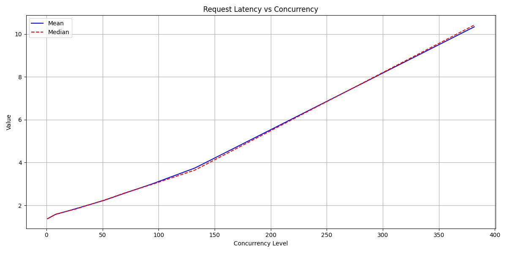
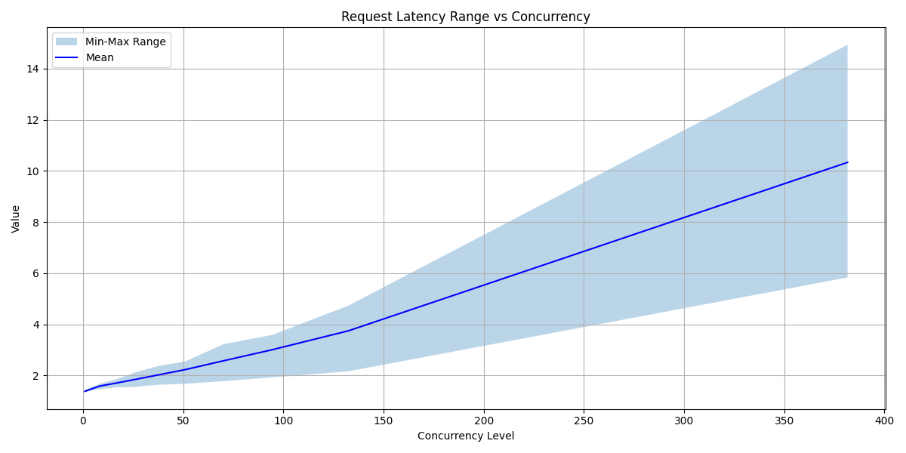
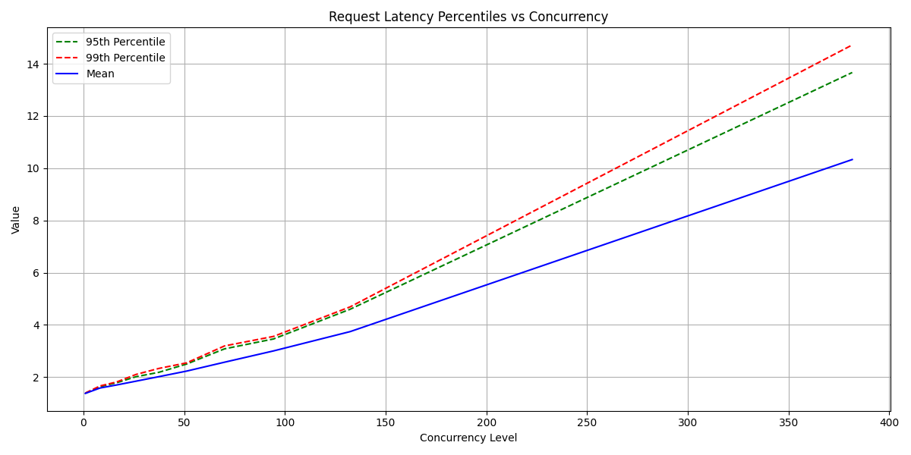

### Time to First Token

- **Low Concurrency (1.0)**: ~30.60ms
- **High Concurrency (381.58)**: ~1732.63ms
- **Observation**: Significant increase at high concurrency, indicating potential queueing effects.

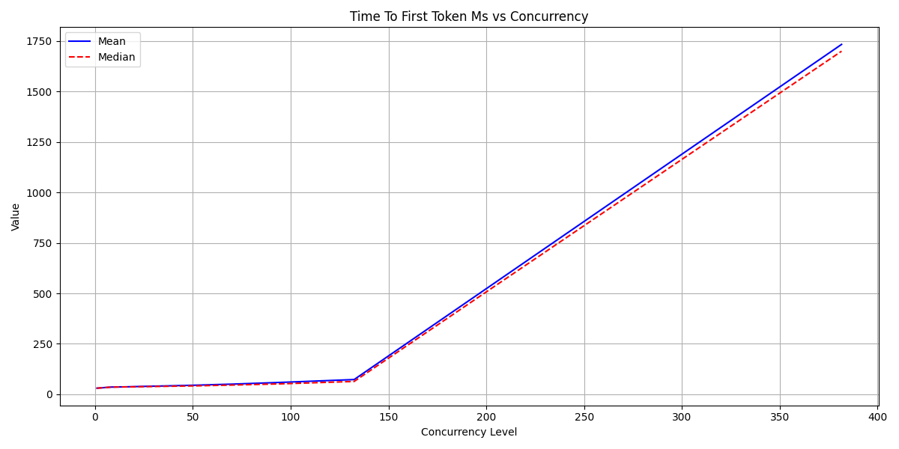
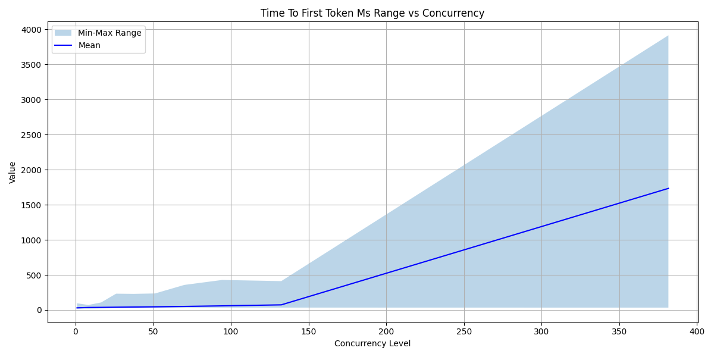
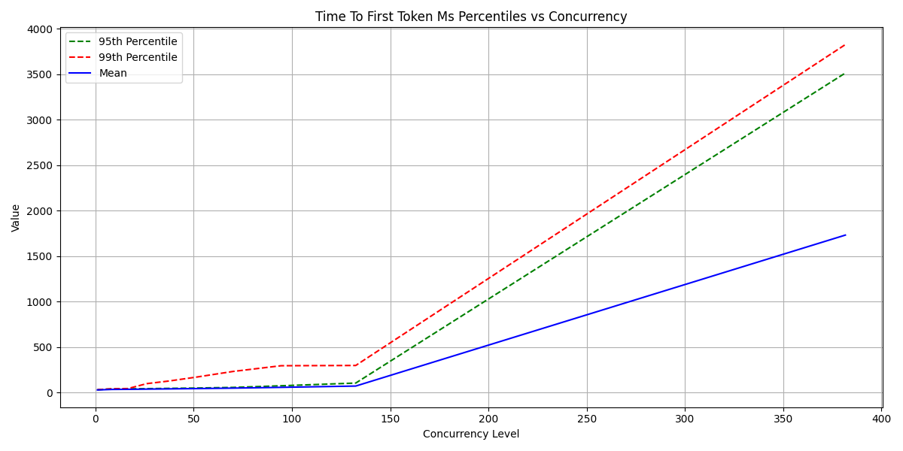

### Throughput

- **Tokens per Second**:
  - Low Concurrency (1.0): ~836.84 tokens/s
  - High Concurrency (381.58): ~42,580.84 tokens/s
- **Observation**: Excellent scaling with concurrency, showing ~50x improvement in throughput.

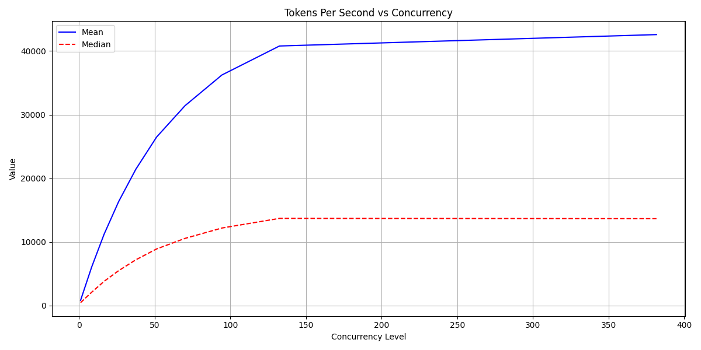
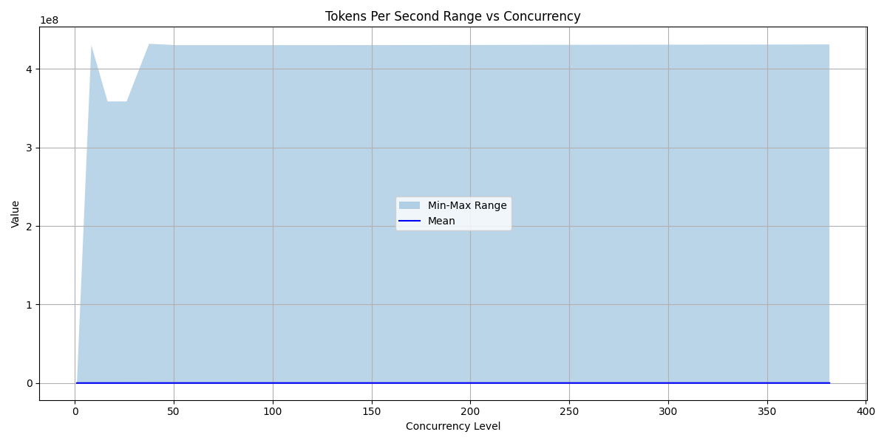
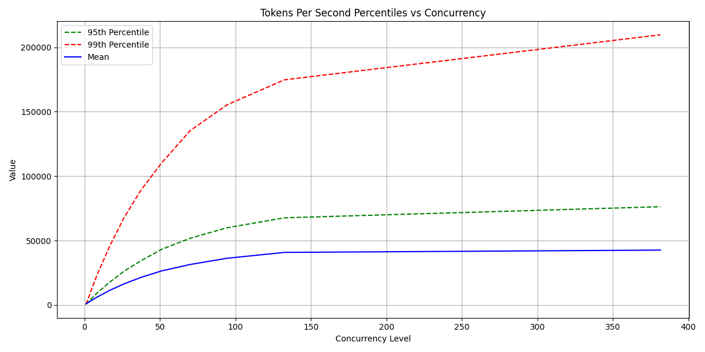

### Inter-token Latency

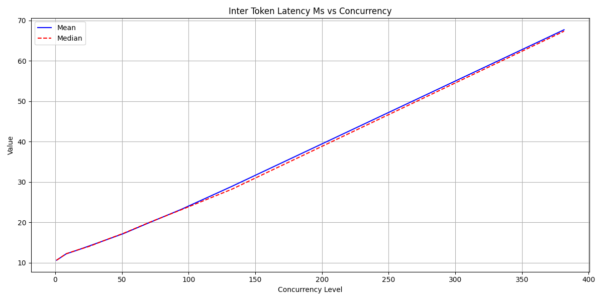
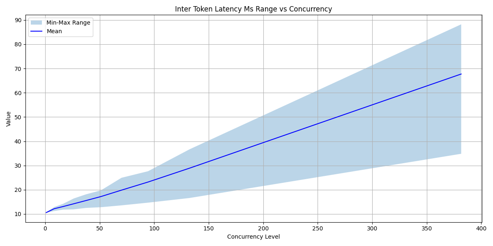
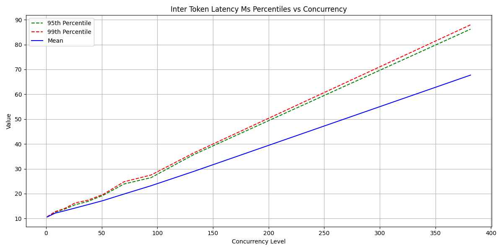

### Consistency

- **Output Token Count**: Consistently 128.0 tokens across all concurrency levels
- **Prompt Token Count**: Consistently ~513.06 tokens across all concurrency levels
- **Observation**: Model maintains consistent output length regardless of load.

## Concurrency Levels Tested

- 1.0 (baseline)
- 8.29
- 16.51
- 26.14
- 37.48
- 51.23
- 70.01
- 94.41
- 132.44
- 381.58

## Key Insights

1. The model shows good scalability, with throughput increasing significantly with concurrency
2. Latency remains reasonable even at high concurrency levels
3. Time to first token is the most sensitive metric to concurrency
4. Output consistency is maintained across all concurrency levels
5. The system demonstrates robust performance under varying loads

## Visualization

The `benchmark_plots` directory contains visualizations showing:
- Mean vs Median comparisons for key metrics
- Min-Max ranges across concurrency levels
- 95th and 99th percentile analyses

## Raw Data

- `llama32-3b.yaml`: Raw benchmark data
- `benchmark_processed_data.csv`: Processed metrics in CSV format 
